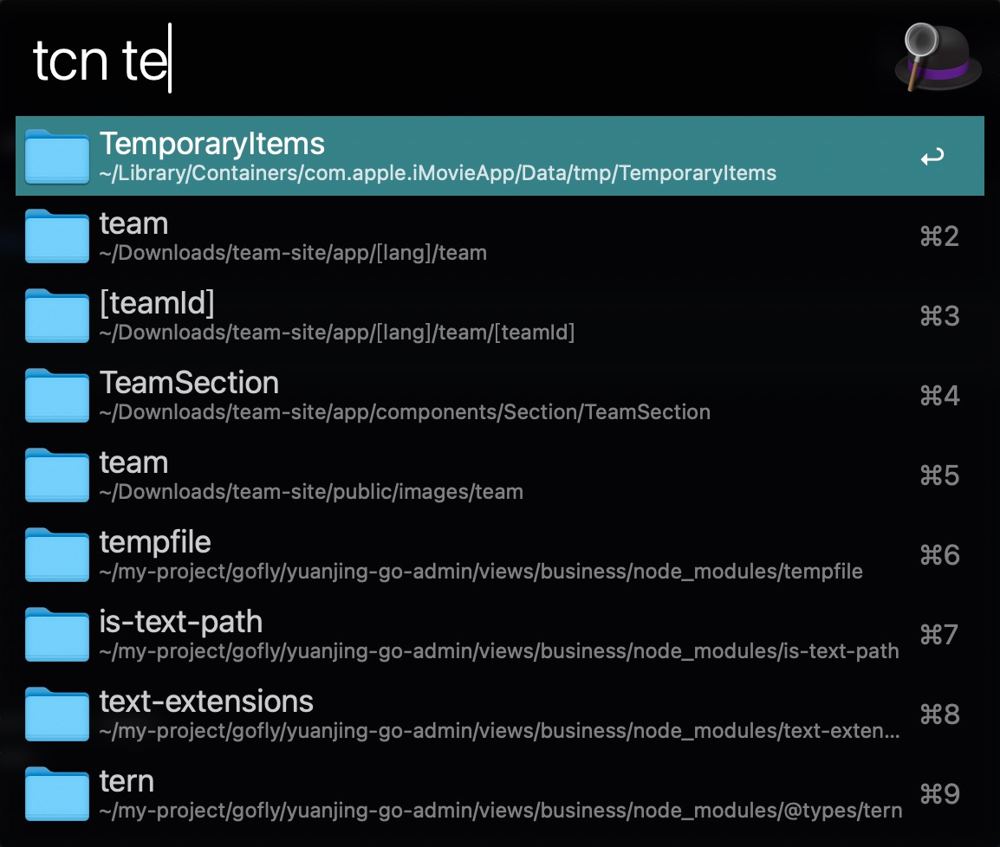

# alfred-open-with-trae

Alfred workflow to open files with trae position.

## Installation

Download the latest release of the workflow from the releases page.
Double-click the downloaded file to install it in Alfred.

## Requirements

- Alfred 4 or later with Powerpack
- Trae installed on your Mac

